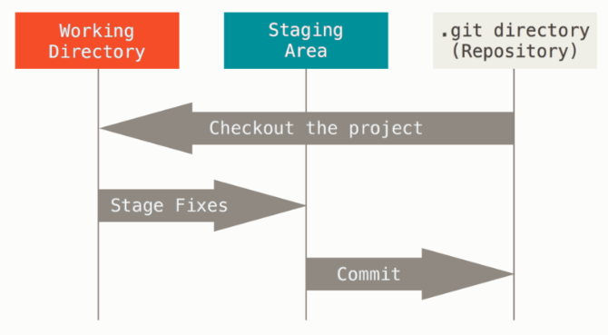

# 一、git三种状态

* 已提交（committed）:已提交表示数据已经安全的保存在本地数据库中。
* 已修改（modified）:已修改表示修改了文件，但还没保存到数据库中。
* 已暂存（staged）:已暂存表示对一个已修改文件的当前版本做了标记，使之包含在下次提交的快照中。

由此引入 Git 项目的三个工作区域的概念：Git 仓库、工作目录以及暂存区域。

基本的 Git 工作流程如下：

1. 在工作目录中修改文件。

2. 暂存文件，将文件的快照放入暂存区域。

3. 提交更新，找到暂存区域的文件，将快照永久性存储到 Git 仓库目录。

如果 Git 目录中保存着的特定版本文件，就属于已提交状态。 
如果作了修改并已放入暂存区域，就属于已暂存状态。 
如果自上次取出后，作了修改但还没有放到暂存区域，
就是已修改状态。