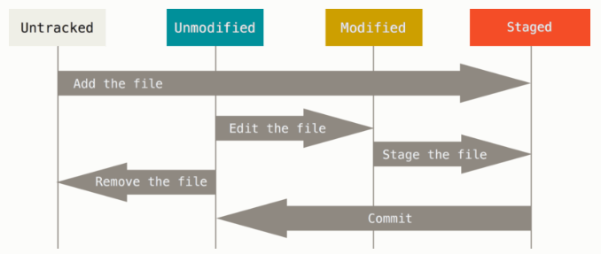

# 一、记录每次更新到仓库

工作目录下的每一个文件都不外乎这两种状态：
已跟踪或未跟踪。 已跟踪的文件是指那些被纳入了版本控制的文件，
在上一次快照中有它们的记录，在工作一段时间后，
它们的状态可能处于未修改，已修改或已放入暂存区。 
工作目录中除已跟踪文件以外的所有其它文件都属于未跟踪文件，
它们既不存在于上次快照的记录中，也没有放入暂存区。 
初次克隆某个仓库的时候，工作目录中的所有文件都属于已跟踪文件，
并处于未修改状态。

编辑过某些文件之后，由于自上次提交后你对它们做了修改，
Git 将它们标记为已修改文件。 
我们逐步将这些修改过的文件放入暂存区，
然后提交所有暂存了的修改，如此反复。
所以使用 Git 时文件的生命周期如下：

