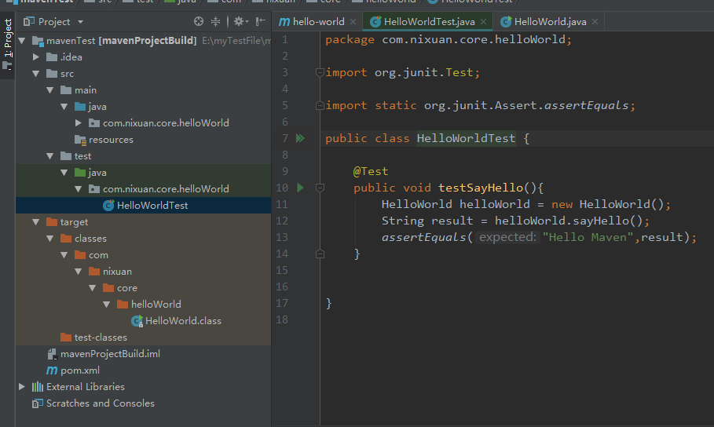
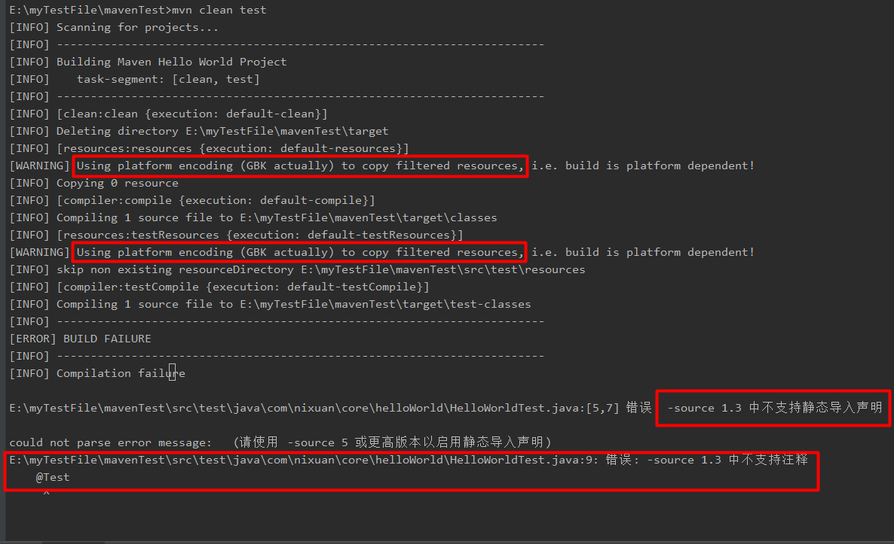
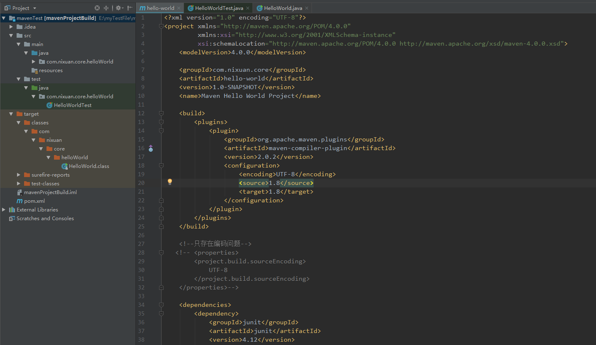
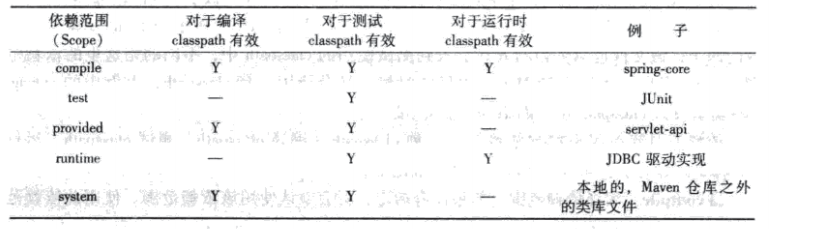
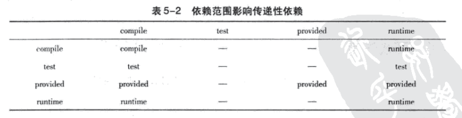
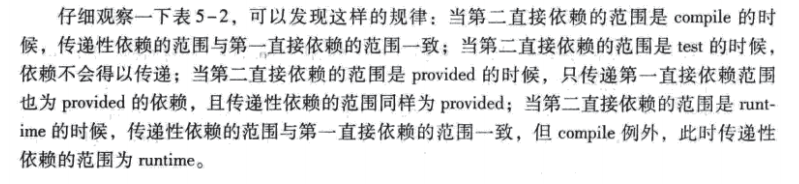

1. mvn clean compile

未执行这条语句的目录


maven首先执行clean：clean任务为删除target/目录，
默认情况下，Maven构建的所有输出都在target/目录中。

接着执行resources；

最后执行compiler：compile任务，将项目主代码编译到target/classes目录中

执行过程图


执行之后


maven项目中默认的主代码目录是src/main/java,
默认的测试代码目录是src/test/java

在test下面添加测试代码



有可能会出现Using platform encoding (GBK actually) to copy filtered resources编码问题和
-source 1.3 中不支持注释@Test。由于历史原因，Maven的核心插件之一——
compiler插件默认只支持编译java1.3，因此需要配置该插件使其支持java1.5及以上版本



如果只出现了编码问题，在pom.xml文件中的project标签中加入
```
<properties>
     <project.build.sourceEncoding>
        UTF-8
     </project.build.sourceEncoding>
</properties>
```
编码问题就可以解决

如果出现了上述两个问题，在pom.xml文件中的project标签中加入
```
    <build>
        <plugins>
            <plugin>
                <groupId>org.apache.maven.plugins</groupId>
                <artifactId>maven-compiler-plugin</artifactId>
                <version>2.0.2</version>
                <configuration>
                    <encoding>UTF-8</encoding>
                    <source>1.8</source>
                    <target>1.8</target>
                </configuration>
            </plugin>
        </plugins>
    </build>
```


两个问题都可以解决。

依赖范围就是用来控制依赖与这三种classpath（编译classpath，测试classpath，运行classpath）的
关系，Maven有以下几种依赖范围：

compile：编译依赖范围。默认就是compile，对三种classpath都有效，如spring-core；

test：测试依赖范围。使用此依赖范围的Maven依赖，只对于测试classpath
有效，在编译主代码或者运行项目时将无法使用此类依赖，如JUnit；

provided：已提供依赖范围。使用此依赖范围的Maven依赖，只对于编译和测试classpath
有效，在运行时无效，如servlet-api，编译和测试项目的时候需要该依赖，但是在运行项目的时候
由于容易已经提供，就不需要Maven重复地引入一遍。

runtime：运行时依赖范围。使用此依赖范围的Maven依赖，只对于测试和运行classpath
有效，在编译主代码时无效，如JDBC驱动实现，项目主代码的编译只需要JDK
提供的JDBC接口，只有在执行测试或者运行项目的时候才需要实现上述接口的具体JDBC
驱动。

system：系统依赖范围。和provided依赖范围完全一致。但是，使用system范围的依赖时必须通过systemPath元素显式
地指定依赖文件的路径。由于此类依赖不是通过Maven仓库解析的，而且往往与本机系统绑定，可能造成构建的不可移植，因此
应该谨慎使用，systemPath元素可以引用环境变量。

import（Maven2.0.9及以上）：导入依赖范围。该依赖范围不会对三种classpath产生实际的影响。



依赖影响传递





依赖调解

Maven依赖调解的第一原则：路径最近者优先

Maven2.0.9开始，为了尽可能的避免构建的不确定性，Maven定义了依赖调解的第二原则：
第一声明者优先。

可选依赖不会得以传递

最佳实践：

1. 排除依赖

2. 归类依赖

3. 优化依赖


