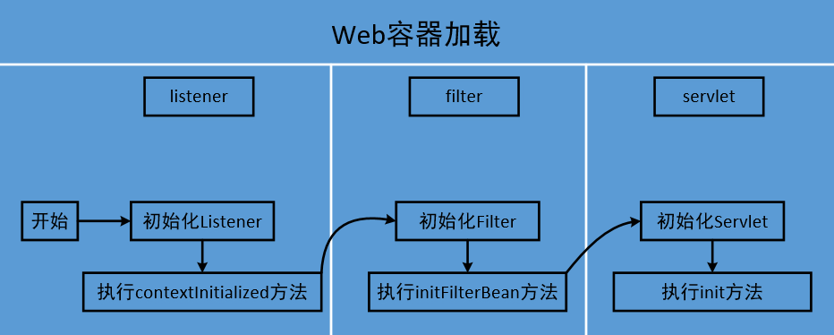
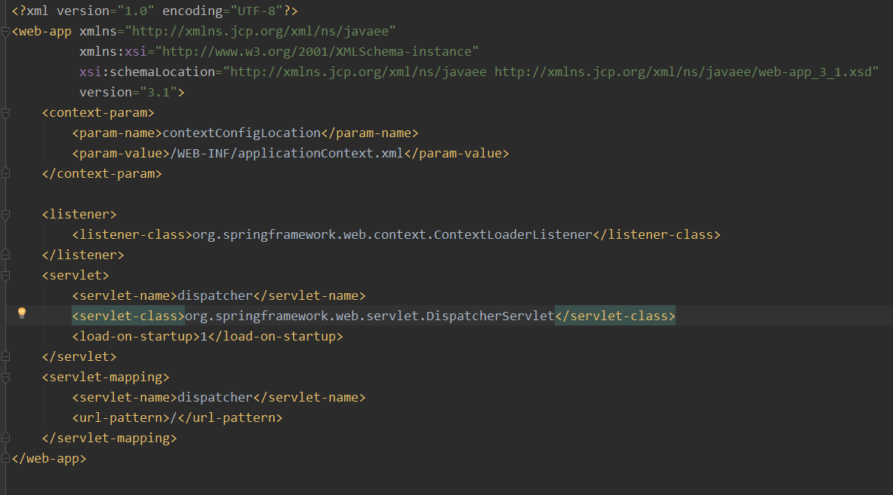

# 1.Web容器的初始化过程

Spring MVC在启动时，首先是进行Web容器的初始化，顺序是listener->filter->servlet,不收.xml文件中配置位置的先后顺序的影响，其初始化步骤如下：

# 2.SpringMVC中web.xml

在<listener>标签中定义了spring容器加载器，在<servlet>标签中定义了spring前端控制器。

在 Servlet API中有一个ServletContextListener接口，它能够监听ServletContext对象的生命周期，实际上就是监听Web应用的生命周期。当Servlet容器启动或终止Web应用时，会触发ServletContextEvent事件，该事件由ServletContextListener来处理。在ServletContextListener接口中定义了处理ServletContextEvent 事件的两个方法contextInitialized()和contextDestroyed()。

ContextLoaderListener监听器的作用就是启动Web容器时，自动装配ApplicationContext的配置信息。因为它实现了ServletContextListener这个接口，在web.xml配置了这个监听器，启动容器时，就会默认执行它实现的方法。由于在ContextLoaderListener中关联了ContextLoader这个类，所以整个加载配置过程由ContextLoader来完成。

initWebApplicationContext方法中首先创建了WebApplicationContext，配置并且实例化整个SpringApplicationContext中的Bean。因此，如果我们的Bean配置出错的话，在容器启动的时候，会抛异常出来的。

综上，ContextLoaderListener类起着至关重要的作用。它读取web.xml中配置的context-param中的配置文件，提前在web容器初始化前准备业务对应的Application context;将创建好的Application context放置于ServletContext中，为springMVC部分的初始化做好准备。

# 3.DispatchServlet初始化

在SpringMVC架构中，DispatchServlet负责请求分发，起到控制器的作用。

