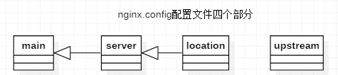

# 一、nginx.conf配置文件

Nginx配置文件主要分成四部分：main（全局设置）、server（主机设置）、
upstream（上游服务器设置，主要为反向代理、负载均衡相关配置）和 location（URL匹配特定位置后的设置），
每部分包含若干个指令。main部分设置的指令将影响其它所有部分的设置；server部分的指令主要用于指定虚拟主机域名、IP和端口；
upstream的指令用于设置一系列的后端服务器，设置反向代理及后端服务器的负载均衡；
location部分用于匹配网页位置（比如，根目录“/”,“/images”,等等）。
他们之间的关系式：server继承main，location继承server；upstream既不会继承指令也不会被继承。
它有自己的特殊指令，不需要在其他地方的应用。



# 二、Nginx 工作原理及安装配置
Nginx有五大优点：模块化、事件驱动、异步、非阻塞、多进程单线程。Nginx 由内核和模块组成，其中，内核的设计非常微小和简洁，完成的工作也非常简单，
仅仅通过查找配置文件将客户端请求映射到一个 location block（location 是 Nginx配置中的一个指令，用于 URL 匹配），
而在这个 location 中所配置的每个指令将会启动不同的模块去完成相应的工作。Nginx 的模块从结构上分为

核心模块、基础模块和第三方模块： 

* 核心模块：HTTP 模块、 EVENT 模块和 MAIL 模块
* 基础模块： HTTP Access 模块、HTTP FastCGI 模块、HTTP Proxy 模块和 HTTP Rewrite模块，
* 第三方模块：HTTP Upstream Request Hash 模块、 Notice 模块和 HTTP Access Key模块。

Nginx 的高并发得益于其采用了 epoll 模型，与传统的服务器程序架构不同，
epoll 是linux 内核 2.6 以后才出现的。 Nginx 采用epoll模型，异步非阻塞，
而 Apache 采用的是select 模型 

Select 特点：select 选择句柄的时候，是遍历所有句柄，也就是说句柄有事件响应时，
select 需要遍历所有句柄才能获取到哪些句柄有事件通知，因此效率是非常低。

epoll 的特点：epoll 对于句柄事件的选择不是遍历的，是事件响应的，就是句柄上事
件来就马上选择出来，不需要遍历整个句柄链表，因此效率非常高 

# 三、Nginx的常用命令

```
验证配置是否正确: nginx -t

查看Nginx的版本号：nginx -V

启动Nginx：start nginx

快速停止或关闭Nginx：nginx -s stop

正常停止或关闭Nginx：nginx -s quit

配置文件修改重装载命令：nginx -s reload
```

# 四、Nginx的location详解

### 1、location语法规则

* location是在server块中配置。

* 可以根据不同的URL使用不同的配置（location中配置），来处理不同请求。

* location是有顺序的，会被第一个匹配的location处理。

|           语法         |                  解释                          |
| --------------------- | -------------------------------------------    |
| location = /uri       | =开头表示精确匹配，只有完全匹配上才能生效          |
|location ^~ /uri       | ^~ 开头对URL路径进行前缀匹配，并且在正则之前       |    
|location ~ 正则表达式   | ~开头表示区分大小写的正则匹配                     |
|location ~*正则表达式   | ~*开头表示不区分大小写的正则匹配                  |
|location !~ 正则表达式  | !~区分大小写不匹配的正则                         |
|location !~*正则表达式  | !~*不区分大小写不匹配的正则                      |
|location /uri          | 不带任何修饰符，也表示前缀匹配，但是在正则匹配之后  |
|location /             | 通用匹配，任何未匹配到其它location的请求都会匹配到，相当于switch中的default
|location @名称          | nginx内部跳转

### 2、location匹配顺序

`(location =) > (location 完整路径) > (location ^~ 路径) > (location ~,~* 正则顺序) > (location 部分起始路径) > (/)`

location优先级官方文档（中英文对照）

1. Directives with the = prefix that match the query exactly. If found, searching stops.

2. All remaining directives with conventional strings, longest match first. If this match used the ^~ prefix, searching stops.

3. Regular expressions, in order of definition in the configuration file.

4. If #3 yielded a match, that result is used. Else the match from #2 is used.

翻译结果：
1. =前缀的指令严格匹配这个查询。如果找到，停止搜索。
2. 所有剩下的常规字符串，最长的匹配。如果这个匹配使用^〜前缀，搜索停止。
3. 正则表达式，在配置文件中定义的顺序。
4. 如果第3条规则产生匹配的话，结果被使用。否则，使用第2条规则的结果。

如果在location中没有找到相匹配的url，连/都没有配置，会返回一个错误

在server_name中如果没有找到匹配的url，则会自动去匹配第一个server。