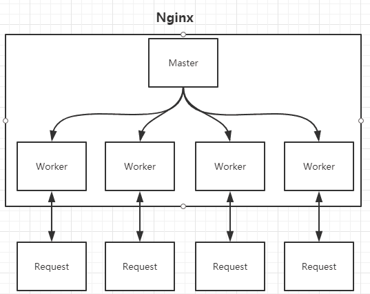

## 一、nginx的进程

Nginx在启动时会以daemon形式在后台运行，
采用多进程+异步非阻塞IO事件模型来处理各种连接请求。
多进程模型包括一个master进程，多个worker进程，
一般worker进程个数是根据服务器CPU核数来决定的。
master进程负责管理Nginx本身和其他worker进程。

在nginx多进程中，每个worker都是平等的，
因此每个进程处理外部请求的机会权重都是一致的。

Nginx主要通过加锁来解决惊群现象

惊群现象：惊群效应就是当一个fd的事件被触发时，
所有等待这个fd的线程或进程都被唤醒。一般都是socket的accept()会导致惊群，
很多个进程都block在server socket的accept()，
一但有客户端进来，所有进程的accept()都会返回，
但是只有一个进程会读到数据，就是惊群。
Nginx 采用accept-mutex来解决惊群问题：当一个请求到达的时候，
只有竞争到锁的worker进程才会惊醒处理请求，其他进程会继续等待，
结合 timer_solution 配置的最大的超时时间继续尝试获取accept-mutex

## 二、热部署实现方式

修改配置文件nginx.conf后，
重新生成新的worker进程，
当然会以新的配置进行处理请求，
而且新的请求都交给新的worker进程，而老的worker进程，
等把那些以前的请求处理完毕后，就会kill。

## 三、高并发下的高效处理

Nginx采用了Linux的epoll模型，
epoll模型基于事件驱动机制，它可以监控多个事件是否准备完毕，
如果OK，那么放入epoll队列中，这个过程是异步的。
worker只需要从epoll队列循环处理即可。
