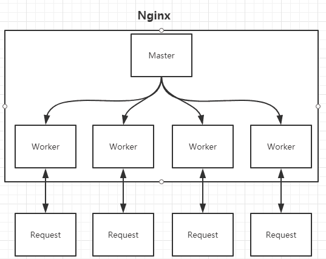

## 一、nginx的进程

Nginx在启动时会以daemon形式在后台运行，
采用多进程+异步非阻塞IO事件模型来处理各种连接请求。
多进程模型包括一个master进程，多个worker进程，
一般worker进程个数是根据服务器CPU核数来决定的。
master进程负责管理Nginx本身和其他worker进程。



在nginx多进程中，每个worker都是平等的，
因此每个进程处理外部请求的机会权重都是一致的。

Nginx主要通过加锁来解决惊群现象

惊群现象：惊群效应就是当一个fd的事件被触发时，
所有等待这个fd的线程或进程都被唤醒，但是其中只有一个进程会接受成功，其余皆失败，重新休眠。

accept（）惊群：主进程创建了socket、bind、listen之后，fork()出来多个进程，每个子进程都开始循环处理（accept）这个listen_fd。
每个进程都阻塞在accept上，当一个新的连接到来时候，所有的进程都会被唤醒，但是其中只有一个进程会接受成功，其余皆失败，重新休眠。

历史上，Linux的accpet确实存在惊群问题，但现在的内核都解决该问题了。
即，当多个进程/线程都阻塞在对同一个socket的接受调用上时，当有一个新的连接到来，
内核只会唤醒一个进程，其他进程保持休眠，压根就不会被唤醒。

在linux2.6版本以后，linux内核已经解决了accept（）函数的“惊群”现象，大概的处理方式是，当内核接收到一个客户连接后，
只会唤醒等待队列上的第一个进程（线程）,所以如果服务器采用accept阻塞调用方式，在最新的linux系统中已经没有“惊群效应”了

epoll惊群：如果多个进程/线程阻塞在监听同一个监听socket fd的epoll_wait上，当有一个新的连接到来时，所有的进程都会被唤醒。

nginx的每个worker进程都会在函数ngx_process_events_and_timers()中处理不同的事件，
然后通过ngx_process_events()封装了不同的事件处理机制，在Linux上默认采用epoll_wait()。

在ngx_process_events_and_timers()函数中解决惊群现象。
```
void ngx_process_events_and_timers(ngx_cycle_t *cycle)
{
    ... ...
    // 是否通过对accept加锁来解决惊群问题，需要工作线程数>1且配置文件打开accetp_mutex
    if (ngx_use_accept_mutex) {
        // 超过配置文件中最大连接数的7/8时，该值大于0，此时满负荷不会再处理新连接，简单负载均衡
        if (ngx_accept_disabled > 0) {
            ngx_accept_disabled--;
        } else {
            // 多个worker仅有一个可以得到这把锁。获取锁不会阻塞过程，而是立刻返回，获取成功的话
            // ngx_accept_mutex_held被置为1。拿到锁意味着监听句柄被放到本进程的epoll中了，如果
            // 没有拿到锁，则监听句柄会被从epoll中取出。
            if (ngx_trylock_accept_mutex(cycle) == NGX_ERROR) {
                return;
            }
            if (ngx_accept_mutex_held) {
                // 此时意味着ngx_process_events()函数中，任何事件都将延后处理，会把accept事件放到
                // ngx_posted_accept_events链表中，epollin|epollout事件都放到ngx_posted_events链表中
                flags |= NGX_POST_EVENTS;
            } else {
                // 拿不到锁，也就不会处理监听的句柄，这个timer实际是传给epoll_wait的超时时间，修改
                // 为最大ngx_accept_mutex_delay意味着epoll_wait更短的超时返回，以免新连接长时间没有得到处理
                if (timer == NGX_TIMER_INFINITE || timer > ngx_accept_mutex_delay) {
                    timer = ngx_accept_mutex_delay;
                }
            }
        }
    }
    ... ...
    (void) ngx_process_events(cycle, timer, flags);   // 实际调用ngx_epoll_process_events函数开始处理
    ... ...
    if (ngx_posted_accept_events) { //如果ngx_posted_accept_events链表有数据，就开始accept建立新连接
        ngx_event_process_posted(cycle, &ngx_posted_accept_events);
    }
 
    if (ngx_accept_mutex_held) { //释放锁后再处理下面的EPOLLIN EPOLLOUT请求
        ngx_shmtx_unlock(&ngx_accept_mutex);
    }
 
    if (delta) {
        ngx_event_expire_timers();
    }
 
    ngx_log_debug1(NGX_LOG_DEBUG_EVENT, cycle->log, 0, "posted events %p", ngx_posted_events);
	// 然后再处理正常的数据读写请求。因为这些请求耗时久，所以在ngx_process_events里NGX_POST_EVENTS标
    // 志将事件都放入ngx_posted_events链表中，延迟到锁释放了再处理。
}}

```
惊群解释及源码解释参考：[Linux惊群效应详解](https://blog.csdn.net/lyztyycode/article/details/78648798)

## 二、热部署实现方式

修改配置文件nginx.conf后，
重新生成新的worker进程，
当然会以新的配置进行处理请求，
而且新的请求都交给新的worker进程，而老的worker进程，
等把那些以前的请求处理完毕后，就会kill。

## 三、高并发下的高效处理

Nginx采用了Linux的epoll模型，
epoll模型基于事件驱动机制，它可以监控多个事件是否准备完毕，
如果OK，那么放入epoll队列中，这个过程是异步的。
worker只需要从epoll队列循环处理即可。
