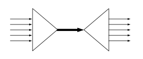

# 一、IO口多路复用的解释

IO口多路复用，I/O multiplexing. 如果你搜索multiplexing啥意思，基本上都会出这个图：

一根网线，多个sock复用,多个Sock复用一根网线这个功能是在内核＋驱动层实现的。

重要的事情再说一遍： I/O multiplexing 这里面的 multiplexing 指的其实是在单个线程通过记录跟踪每一个Sock(I/O流)的状态(对应空管塔里面的Fight progress strip槽)来同时管理多个I/O流. 发明它的原因，是尽量多的提高服务器的吞吐能力。

是不是听起来好拗口，看个图就懂了.

在同一个线程里面， 通过拨开关的方式，来同时传输多个I/O流， (学过EE的人现在可以站出来义正严辞说这个叫“时分复用”了）。

在ngnix中，ngnix会有很多链接进来， epoll会把他们都监视起来，然后像拨开关一样，谁有数据就拨向谁，然后调用相应的代码处理。

select, poll, epoll 都是I/O多路复用的具体的实现，之所以有这三个鬼存在，其实是他们出现是有先后顺序的。

select, poll, epoll 都是I/O多路复用的具体的实现，之所以有这三个存在，其实是他们出现是有先后顺序的。

I/O多路复用这个概念被提出来以后， select是第一个实现 (1983 左右在BSD里面实现的)。

select 被实现以后，很快就暴露出了很多问题。
* select 会修改传入的参数数组，这个对于一个需要调用很多次的函数，是非常不友好的。 
* select 如果任何一个sock(I/O stream)出现了数据，select 仅仅会返回，但是并不会告诉你是那个sock上有数据，于是你只能自己一个一个的找，10几个sock可能还好，要是几万的sock每次都找一遍，这个无谓的开销就颇有海天盛筵的豪气了。
* select 只能监视1024个链接，linux 定义在头文件中的，参见FD_SETSIZE。
* select 不是线程安全的，如果你把一个sock加入到select, 然后突然另外一个线程发现，尼玛，这个sock不用，要收回。对不起，这个select 不支持的，如果你丧心病狂的竟然关掉这个sock, select的标准行为是。。呃。。不可预测的， 这个可是写在文档中的哦. 
        
 “If a file descriptor being monitored by select() is closed in another thread, the result is unspecified”  
 
 于是14年以后(1997年）一帮人又实现了poll,  poll 修复了select的很多问题，比如
 
* poll 去掉了1024个链接的限制，于是要多少链接呢， 主人你开心就好。 
* poll 从设计上来说，不再修改传入数组，不过这个要看你的平台了，所以行走江湖，还是小心为妙。

但是poll仍然不是线程安全的， 这就意味着，不管服务器有多强悍，你也只能在一个线程里面处理一组I/O流。你当然可以那多进程来配合了，不过然后你就有了多进程的各种问题。

于是5年以后, 在2002, 大神 Davide Libenzi 实现了epoll.epoll 可以说是I/O 多路复用最新的一个实现，epoll 修复了poll 和select绝大部分问题, 比如：

* epoll 现在是线程安全的。
* epoll 现在不仅告诉你sock组里面数据，还会告诉你具体哪个sock有数据，你不用自己去找了。

可是epoll 有个致命的缺点。只有linux支持。比如BSD上面对应的实现是kqueue。Nginx由于使用了epoll模型，要求linux的内核必须在2.6以上。