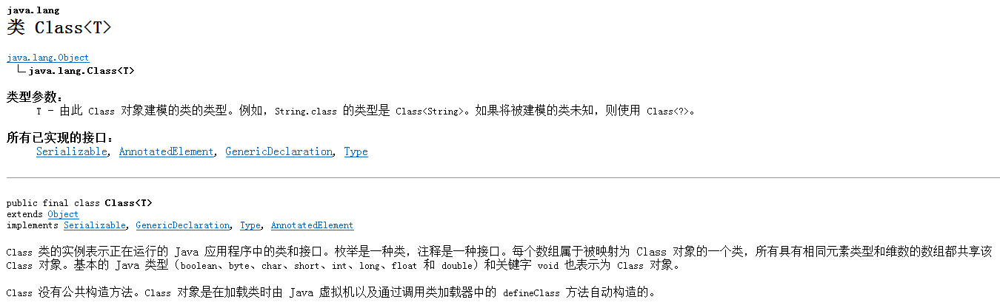

# 一、与反射有关的类和获取对象

java.lang.reflect.*;和java.lang.Class;

Java中所有类型(包括基本类型)都对应一个Class对象,这个Class就是java.lang.Class。
即每一个类型,在Class中都有一个Class对象跟它对应.Class 没有公共构造方法。注意不是没有,是没有公共的.



1. 针对每一个对象.getClass(),可以得到对应的Class.
2. Class.forName(String),String的写法:包名.类名.就会创建包名.类名对应的那个对象
注：第一条和第二条只适用于引用类型
3. 对于基本类型：封装类.TYPE代表了对应的基本类型的Class对象.Integer.TYPE对应的是int的Class对象
注：第三条只适用于基本类型
4. 类型.Class。<第4种是通用的.>,平时使用要导包的类型用这种方法时也要导包

上面的4种方法,只有方法2是动态的,只要换一个包就可以了.它具有动态潜质.所以真正意义的想体现动态编程只能使用方法2.
```
//通过对象的getClass()方法
		Class<?> clazz1 =str.getClass();
		
//通过Class类的静态方法forName(String className)
Class<?> clazz3 =Class.forName("java.lang.String");

//对于基本类型
Class num1 = Integer.TYPE;
Class num2 = int.class;
System.out.println(num1 == num2);//true
		
//通过类的class属性
Class<?> clazz2 =String.class;
```
# 二、反射获取类中成员的相关方法

### 1.获取构造方法
```
Constructor<T> getConstructor(Class<?>... parameterTypes) 
      返回一个 Constructor 对象，它反映此 Class 对象所表示的类的指定公共构造方法。 
Constructor<?>[] getConstructors() 
      返回一个包含某些 Constructor 对象的数组，这些对象反映此 Class 对象所表示的类的所有公共构造方法。 
Constructor<T> getDeclaredConstructor(Class<?>... parameterTypes) 
      返回一个 Constructor 对象，该对象反映此 Class 对象所表示的类或接口的指定构造方法。 
Constructor<?>[] getDeclaredConstructors() 
      返回 Constructor 对象的一个数组，这些对象反映此 Class 对象表示的类声明的所有构造方法。
```
### 2.获取属性
```
Field getField(String name) 
      返回一个 Field 对象，它反映此 Class 对象所表示的类或接口的指定公共成员字段。 
Field[] getFields() 
      返回一个包含某些 Field 对象的数组，这些对象反映此 Class 对象所表示的类或接口的所有可访问公共字段。 
Field getDeclaredField(String name) 
      返回一个 Field 对象，该对象反映此 Class 对象所表示的类或接口的指定已声明字段。 
Field[] getDeclaredFields() 
      返回 Field 对象的一个数组，这些对象反映此 Class 对象所表示的类或接口所声明的所有字段。
```
### 3.获取方法
```
Method getMethod(String name, Class<?>... parameterTypes) 
      返回一个 Method 对象，它反映此 Class 对象所表示的类或接口的指定公共成员方法。 
 Method[] getMethods() 
      返回一个包含某些 Method 对象的数组，这些对象反映此 Class 对象所表示的类或接口（包括那些由该类或接口声明的以及从超类和超接口继承的那些的类或接口）的公共 member 方法。 
 Method getDeclaredMethod(String name, Class<?>... parameterTypes) 
      返回一个 Method 对象，该对象反映此 Class 对象所表示的类或接口的指定已声明方法。 
 Method[] getDeclaredMethods() 
      返回 Method 对象的一个数组，这些对象反映此 Class 对象表示的类或接口声明的所有方法，包括公共、保护、默认（包）访问和私有方法，但不包括继承的方法。 
 T newInstance() 
      创建此 Class 对象所表示的类的一个新实例。 <new Instance()可以动态的创建对象>
 String toString() 
      将对象转换为字符串。
```
notice:

new Instance()调用的是无参构造,如果该类没有无参构造方法,则newInstance()会产生异常.

有declared的方法是支持私有,但是不支持继承,无declared的方法支持继承,不支持私有,且只能取出public的东西.

因此取属性的时候一般来说是带declared的,因为属性一般都是私有的,取方法时一般是不带declared的,
取构造时一般也是不带declared的.

# 三、实例

### 1.利用反射对属性进行赋值

```
Class c = Student.class;
Object obj  = c.newInstance();            //创建Student类的对象
Field f = c.getDeclaredField("name");        //获取name属性
f.setAccessible(true);                    //设置私有可以访问.
f.set(obj, "zhangsan");
System.out.println(f.get(obj));             //获取obj的name属性的值.
```
### 2.利用反射调用构造

```
 Class c = Class.forName("com.clazz.reflect.Student");
 Constructor con = c.getConstructor();         //没有执行构造,
 Object cObj = c.getConstructor().newInstance();//调用无参的构造方法
 Constructor conAll = c.getConstructor(int.class,String.class,int.class);
 Object caobj = conAll.newInstance(1001,"zjamgs",234235);//调用含参的构造方法.
 System.out.println(caobj);
```
### 3.利用反射调用方法

```
Class c = Class.forName("com.clazz.reflect.Student");
Object obj = c.newInstance();    //创建Sutdent对象.
Method msetName = c.getMethod("setName", String.class);//obj无须转换类型
msetName.invoke(obj, "zhangsan");//调用方法setName, 并传参.
Method msetId = c.getMethod("setId", int.class);
msetId.invoke(obj, 409090202);
System.out.println(obj);
```


